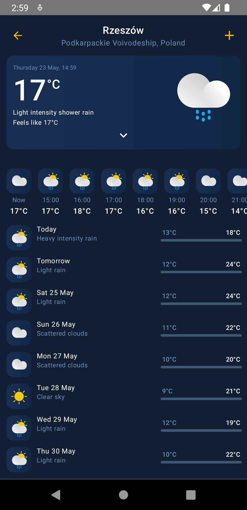

# Breezy - Weather Forecast Application

Welcome to the Weather Demo Application! This is a sample native android weather application
developed by Dawid Jamroży to demonstrate how to fetch and display weather information using a
weather API. Application uses various Jetpack libraries and Material 3 components to provide a
modern and user-friendly interface.

## 1. Features

- Fetches current weather information based on the user's location or a specific city.
- Displays weather details such as temperature, humidity, wind speed, and weather conditions.
- User-friendly interface with easy-to-read weather data.
- Supports light and dark themes.
- Displays a graph of temperature changes throughout the day.
- Saves user preferences and weather data using local storage.
- Supports multiple languages (English and Polish).

## 2. Application architecture

The application is built using the MVI (Model-View-Intent) architecture pattern and is modularized
by features and layers into following modules:

- **app** - Main application module containing the UI and navigation logic.
- **core** - Core module containing shared code and utilities.
    - **data** - Core data module containing data sources and repositories.
    - **database** - Core database module containing database and DAOs.
    - **domain** - Core domain module containing business logic and use cases.
    - **model** - Core model module containing data models and entities.
    - **network** - Core network module containing network services and API clients.
    - **ui** - Core UI module containing shared UI components and utilities.
- **addCity** - Feature module for adding a new city to the user's location list.
    - **data** - Add City data module containing data sources and repositories.
    - **domain** - Add City domain module containing business logic and use cases.
    - **presentation** - Add City presentation module containing views, view models and view states.
- **featureDailyForecast** - Feature module for displaying daily weather forecast.
    - **presentation** - Feature Daily Forecast presentation module containing view models and view states.
- **featureHourlyForecast** - Secrets module containing API keys and secrets.
    - **presentation** - Feature Hourly Forecast presentation module containing view models and view states.
- **myLocations** - My Locations module for displaying user's saved locations.
    - **data** - My Locations data module containing data sources and repositories.
    - **domain** - My Locations domain module containing business logic and use cases.
    - **presentation** - My Locations presentation module containing views, view models and view states.
- **search** - Search module for searching weather data for a specific city.
  - **data** - Search data module containing data sources and repositories.
  - **domain** - Search domain module containing business logic and use cases.
  - **presentation** - Search presentation module containing views, view models and view states.
- **settings** - Settings module for displaying and changing application settings.
  - **data** - Settings data module containing data sources and repositories.
  - **domain** - Settings domain module containing business logic and use cases.
  - **presentation** - Settings presentation module containing views, view models and view states.
- **weather** - Weather module for displaying weather information.
  - **data** - Weather data module containing data sources and repositories.
  - **domain** - Weather domain module containing business logic and use cases.
  - **presentation** - Weather presentation module containing views, view models and view states.

## 3. Technologies Used

- Language
    - Kotlin
- Async Programming
    - Coroutines
    - Flow
- UI
    - Jetpack Compose (UI/Navigation)
    - Accompanist Permissions
    - AndroidX Core
    - Material 3
    - Vico (Graphs)
- Dependency injection
    - Dagger Hilt
- API
    - Google Play Services - (Places/Location/Geocoding)
    - Open Weather Map
- Storage
    - Room
    - Datastore
- Networking
    - OkHttp
    - Retrofit
- Data Serialization
    - Kotlinx Serialization
- Other
    - Secrets Gradle Plugin

## 4. Installation

To run this project locally, follow these steps:

1. **Clone the repository**:
    ```sh
    git clone https://github.com/DawidJamrozy/WeatherApplication.git
    ```

2. **Navigate to the project directory**:
    ```sh
    cd WeatherApplication
    ```

3. **Get an OpenWeatherMap API key**:
    - Sign up for a One Call API 3.0 key from a weather API
      provider [OpenWeatherMap](https://openweathermap.org/) (first 1000 requests are free).

4. **Get an Google API key**:
    - Sign up for a Google Cloud API key with **Places API** and **Geocoding API** features enabled
      from Google Cloud Console (initial usage is free with limited quota).

5. **Create a `secret.properties` file**:
    - In the project root, create a `secret.properties` file and add your API key from point 4 and
      5:
    ```sh
    GOOGLE_API_KEY=your_google_api_key
    OPEN_WEATHER_API_KEY=your_openweathermap_api_key
    ```

6. **Build android studio project and run the application on emulator or physical device**:

## 5. Usage

- Install and run the application on your device.
- Input a city name in the search bar to fetch weather data for a specific location or allow
  location access to fetch weather data for your current location.
- View the current weather information displayed on the screen.
- Click on the weather card to view extended weather information.
- View detailed weather information for the next 7 days.
- View a graph of temperature changes throughout 48-hours interval.
- View and change the application settings such as degree units, pressure units, temperature units
  and theme.

### 5.1 Permissions

- The application requires location permission to fetch weather data based on the user's location.
- The application requires internet access to fetch weather data from the weather API.

## 6. Screenshots

### 6.1 Light mode


### 6.2 Dark mode





## 7. Acknowledgments

- Inspired by various weather applications.

## 8. Contact

- For any inquiries or feedback, please contact Dawid Jamroży at dawidjamrozy@gmail.com.